<td style="width: 10%;">
    
</td>

### **CENTRO FEDERAL DE EDUCAÇÃO TECNOLÓGICA DE MINAS GERAIS**  
### **Departamento de Engenharia Elétrica - CEFET-MG**  
### **Coordenação do Curso de Eletrotécnica**  

### Disciplina: **PLIP - Prática de Laboratório de Instalações Prediais**
### Guia de Aula – Chave-bóia e acionamento de motobomba 

## 1. Objetivo da Aula
Esta aula prática tem como objetivo permitir ao estudante compreender, instalar e testar um sistema de controle automático de nível de água utilizando **duas chaves-bóia** (superior e inferior) associadas ao acionamento de uma **motobomba elétrica**. Ao final da prática, o aluno deverá ser capaz de:

- Identificar os componentes principais de um sistema de bombeamento (motobomba, reservatório superior, reservatório inferior, chaves-bóia).
- Compreender o funcionamento dos contatos **NA** e **NF** das chaves-bóia e suas aplicações.
- Realizar a ligação elétrica em série para controle automático de enchimento.
- Testar o comportamento do sistema em condições reais de operação:
  - caixa superior cheia,
  - caixa superior vazia,
  - caixa inferior cheia,
  - caixa inferior vazia.
- Verificar a proteção da bomba contra funcionamento a seco.
- Interpretar diagramas elétricos de comando.
- Diagnosticar possíveis falhas e propor correções.

### 2. Introdução

O controle automático de nível de água é essencial em sistemas de abastecimento, garantindo segurança, economia e proteção da motobomba. Para que a bomba opere apenas quando houver água disponível na caixa d'água inferior/cisterna e necessidade de enchimento da caixa-d’água superior, utilizam-se duas chaves-bóia instaladas nos reservatórios. A chave-bóia superior interrompe o enchimento quando a caixa atinge o nível máximo, enquanto a chave-bóia inferior impede que a bomba funcione sem água. A associação dessas chaves permite um acionamento seguro, automático e confiável do sistema de bombeamento.

###  2.1. O que é uma Chave Boia?
A chave-bóia é um dispositivo eletromecânico utilizado para acionar ou interromper automaticamente o funcionamento de uma motobomba de acordo com o nível da água no reservatório. Sua função principal é proteger o sistema, evitando o funcionamento a seco, o transbordamento e a queima da bomba. Existem diversos modelos disponíveis no mercado, cada um adequado a diferentes aplicações e condições de instalação.

    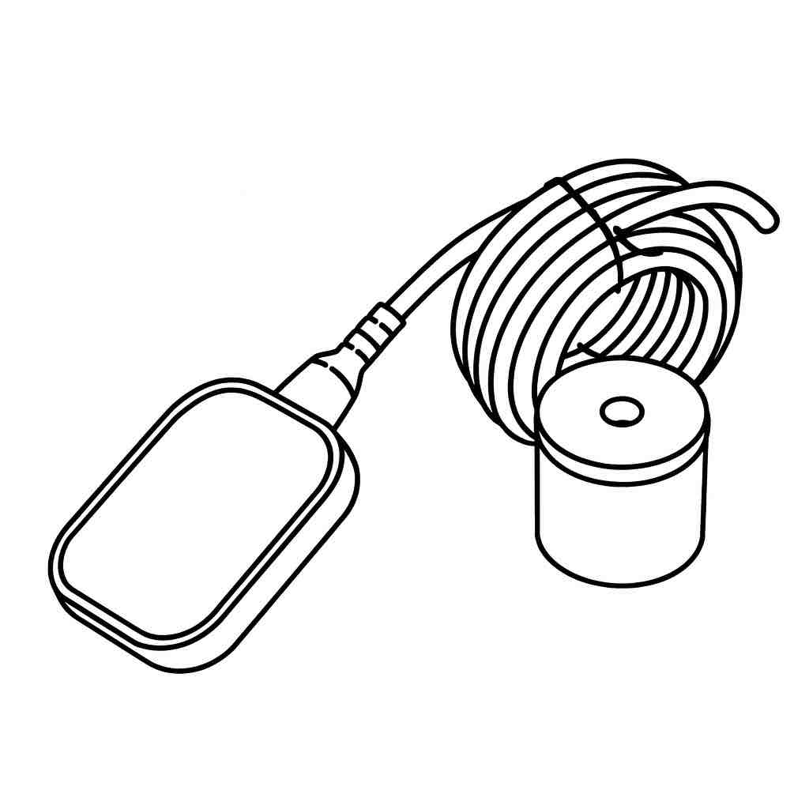
    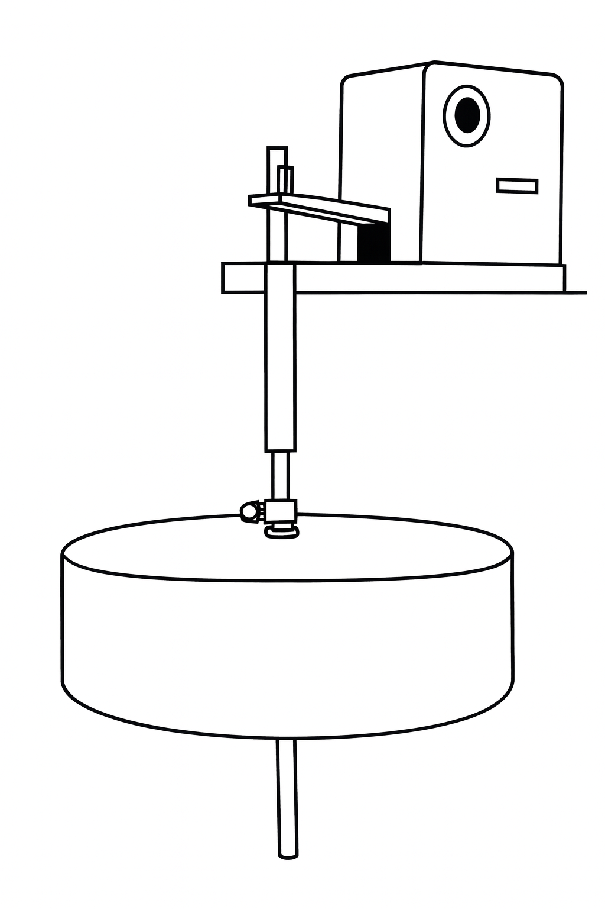
    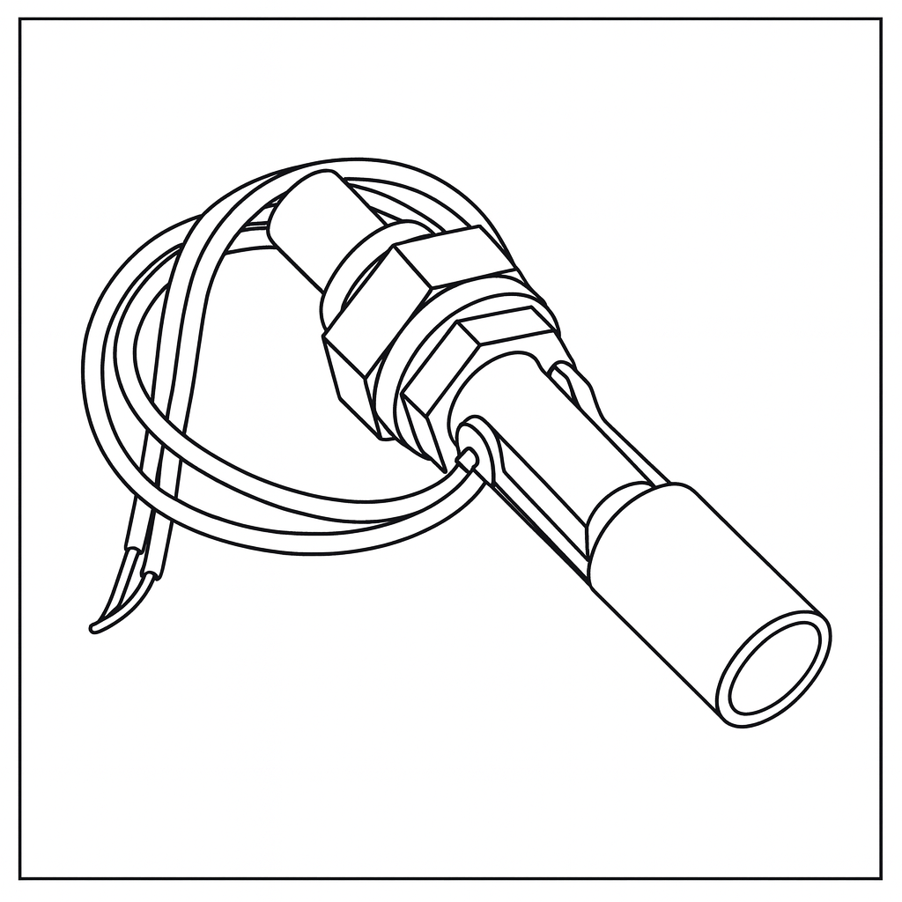

Existem duas ligações possíveis:
- **Nível superior (caixa d’água)** — desliga a bomba quando cheia.
- **Nível inferior (cisterna/poço)** — impede funcionamento sem água.

---

###  2.2. Lógica das Boias

As bombas hidráulicas utilizadas em residências ou edifícios têm como finalidade transferir água de uma cisterna ou reservatório inferior para uma caixa d’água superior. Para garantir **comodidade**, **economia de energia** e **proteção do motor elétrico**, a bomba deve interromper seu funcionamento automaticamente nas seguintes situações:

- Quando a caixa d’água superior estiver **cheia**;
- Quando o reservatório inferior estiver **vazio**.

Para que essas condições sejam atendidas, é necessário utilizar dispositivos capazes de monitorar continuamente o nível de água nos reservatórios. Esses dispositivos de controle, conhecidos como **chave-bóia inferior** e **chave-bóia superior**, devem ser instalados **em série**, de modo que o circuito de comando da bomba seja energizado apenas quando:

- O reservatório superior estiver **vazio**, e
- O reservatório inferior estiver **cheio**.

    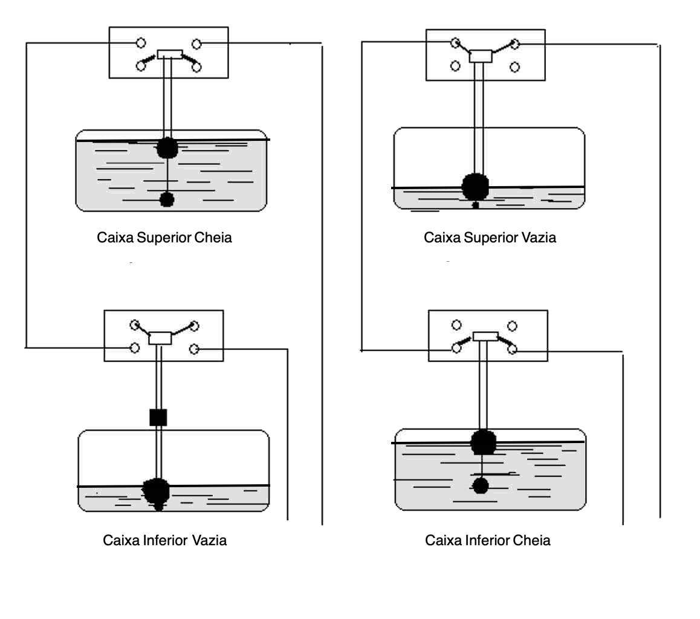
    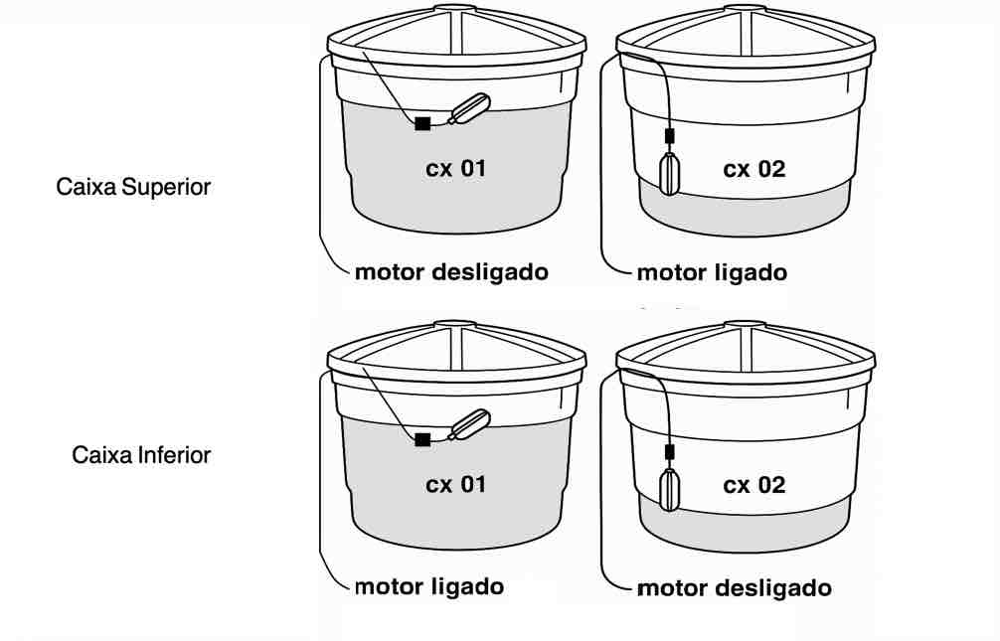

**Caixa d’água superior — NF**
- Cheia → abre → bomba desliga  
- Baixa → fecha → bomba liga

**isterna/caixa inferior — NA**
- Com água → fecha → bomba pode ligar  
- Sem água → abre → bomba desliga

---

### 2.3. Chave-Bóia com Contato Metálico 

Este tipo de chave-bóia é composto por:

- Uma **haste** (a);
- Dois **limitadores de curso** (b);
- Uma **bóia plástica** (c);
- Um conjunto de **contatos elétricos** (d).

**Funcionamento**

- À medida que o nível da água **desce**, a bóia se desloca até pressionar o limitador inferior.
- Esse movimento empurra a haste para baixo.
- Ao superar a resistência de uma mola interna, os contatos elétricos mudam de posição, permitindo **acionar ou desligar** o motor elétrico da bomba.

De forma semelhante, quando o nível da água **sobe**, a bóia pressiona o limitador superior, deslocando a haste para cima e novamente alterando a posição dos contatos elétricos conforme a condição operacional desejada.

---

### 2.4. Chave-Bóia de Controle de Nível com Contato Reversível

A chave-bóia de controle de nível com contato reversível é um dispositivo eletromecânico utilizado para monitorar e controlar o nível de líquidos em reservatórios. Seu funcionamento baseia-se na movimentação de uma bóia que, ao acompanhar a variação do nível do líquido, aciona internamente um conjunto de contatos elétricos configurados em **modo reversível** (NA/NF).

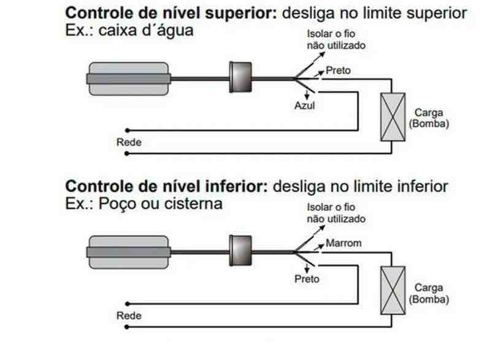

**Características Principais**

- **Bóia flutuante:** Elemento responsável por acompanhar o nível do líquido. Geralmente fabricada em material plástico resistente e impermeável.
- **Cabo flexível:** Conecta a bóia ao ponto de instalação e abriga internamente o condutor elétrico e o mecanismo de comutação.
- **Contato reversível (NA/NF):** O dispositivo possui um microinterruptor interno com um contato **normalmente aberto (NA)** e outro **normalmente fechado (NF)**, permitindo sua utilização tanto para esvaziar quanto para encher o reservatório.
- **Peso regulador:** Mantém a bóia em posição adequada para o movimento de basculamento que aciona a comutação elétrica.

**Funcionamento**

O funcionamento da chave-bóia ocorre pelo **basculamento** da bóia devido à variação do nível do líquido:

1. Quando o nível do líquido **sobe**, a bóia flutua e muda sua posição angular.
2. Ao atingir o ponto de comutação, o peso interno da bóia aciona o microinterruptor, alterando o estado dos contatos:
   - O contato **NA** fecha,
   - O contato **NF** abre.
3. Quando o nível **desce**, a bóia retorna à posição oposta, invertendo novamente os contatos.

Esse comportamento permite duas aplicações distintas:

### Modo Enchimento
- O contato **NF** é usado para manter a bomba ligada enquanto o reservatório está vazio.
- Quando a água sobe e aciona a bóia, o contato abre e **desliga a bomba**.

### Modo Esvaziamento
- O contato **NA** é usado para acionar a bomba quando o reservatório está cheio.
- Quando o nível diminui e a bóia retorna, o contato abre e **desliga a bomba**.

**Resumo do Funcionamento**

| Bóia     | Tipo de Contato | Estado que Fecha   | Finalidade                         |
|----------|------------------|--------------------|-------------------------------------|
| Superior | NF (Normalmente Fechado) | Caixa vazia        | Permite ligar a bomba para encher  |
| Inferior | NA (Normalmente Aberto)  | Cisterna cheia     | Impede ligar a bomba sem água      |

---

### 2.5. Motobomba
A motobomba é um equipamento eletromecânico que realiza o bombeamento de líquidos por meio da conversão da energia elétrica em energia mecânica e, posteriormente, em energia hidráulica. O conjunto é composto essencialmente por um **motor elétrico** acoplado a um **conjunto hidráulico** (carcaça, rotor/impulsor e voluta).

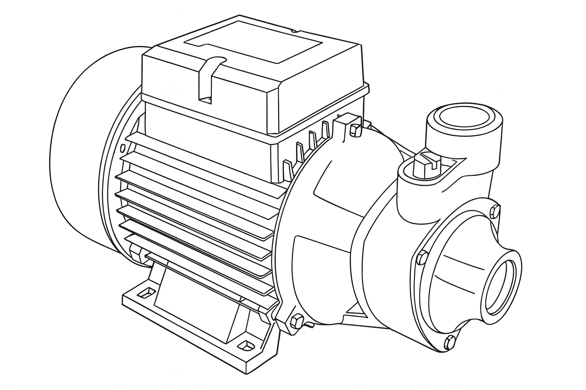

**Funcionamento de uma Motobomba**

**Conversão de Energia no Motor Elétrico**
Quando o motor é alimentado pela rede elétrica:
- A corrente percorre os enrolamentos do estator.
- Forma-se um campo eletromagnético.
- Esse campo induz movimento no rotor, que passa a girar em alta rotação.
O eixo do rotor é acoplado diretamente ao **impulsor** da bomba.

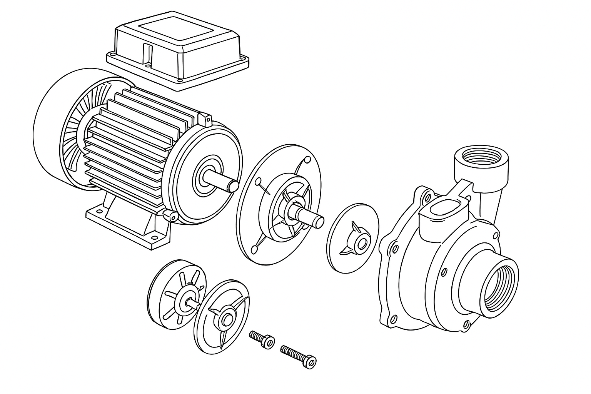

**Funcionamento Hidráulico Interno**
Ao girar, o impulsor exerce força centrífuga sobre a água:

1. A água entra pela **sucção** (bocal de entrada) devido à depressão gerada no centro do impulsor.
2. O impulsor acelera a água para a periferia da bomba.
3. A água ganha energia de velocidade e pressão.
4. A voluta ou carcaça converte parte dessa velocidade em **pressão**, direcionando o fluxo ao **bocal de recalque** (saída).

Esse processo permite transferir a água do ponto de sucção (cisterna/caixa inferior) para o ponto de descarga (caixa superior).

**Condições Necessárias para Operação**
Para operar corretamente, a motobomba requer:
- **Alimentação elétrica adequada** (tensão e corrente).
- **Câmara hidráulica cheia de água** (evitar cavitação e funcionamento a seco).
- **Sucção livre de ar** (vedação e engolimento de ar comprometem o fluxo).
- **Altura manométrica compatível** com a capacidade da bomba.
- **Motor refrigerado**, geralmente pelo próprio ar ambiente ou pelo fluxo de água.

**Riscos e Proteções**
A motobomba pode sofrer danos se operar em condições inadequadas, tais como:
- Falta de água → superaquecimento e travamento.
- Sobrecarga elétrica → queima do motor.
- Pressão excessiva → desgaste prematuro dos componentes.

Por isso, recomenda-se o uso de:
- **Chaves-bóia** para monitoramento de nível,
- **Relé térmico** para proteção contra sobrecarga,
- **Válvula de retenção** para evitar retorno de água.

---
##  3. Parte Prática

**⚠️ 3.1 Segurança**
Desligue a energia antes de trabalhar. Use EPI e ferramentas isoladas.

**3.2. Quando usar Contator ?**
Recomendado para bombas acima de 1 CV, instalações trifásicas ou cabos longos.

**3.3 Testes**
- Testar continuidade com multímetro.
- Elevar/abaixar a boia e verificar mudança de estado.
- Ligar o sistema e observar funcionamento.

**3.4 Materiais Necessários**
- Motobomba
- Chave(s) boia
- Contator (recomendado acima de 1 CV)
- Disjuntor
- Cabos elétricos
- Painel elétrico opcional

**3.5 Instalação Passo a Passo**
1. Verificar a ligação da boia (inferior/superio) .
2. Verificar o motor da motobomba (monofásio-p/220V ou trifásico-triângulo220V)
3. Fixar a boia na caixa superior e ajustar comprimento do cabo.
4. Instalar boia na cisterna/caixa inferior.
5. Passar cabos em eletrodutos.
6. Ligar boias conforme o diagrama.

**3.5.1. Diagrama Comando**

**3.5.2. Diagrama Carga**

    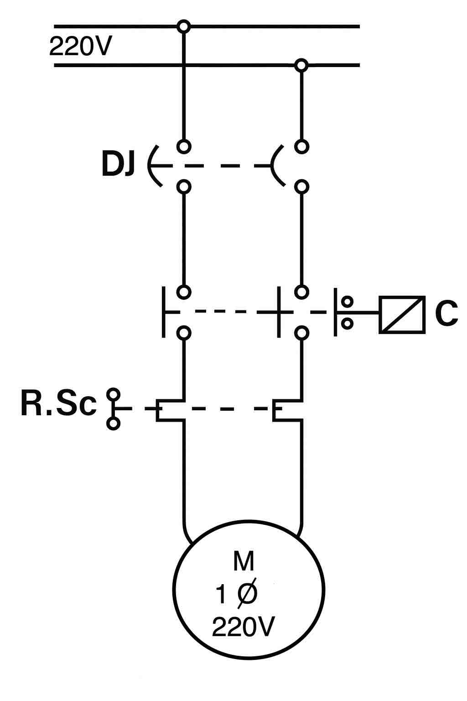
    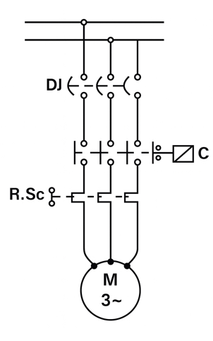

**3.5.3. Diagrama Completo (2 Boias)**

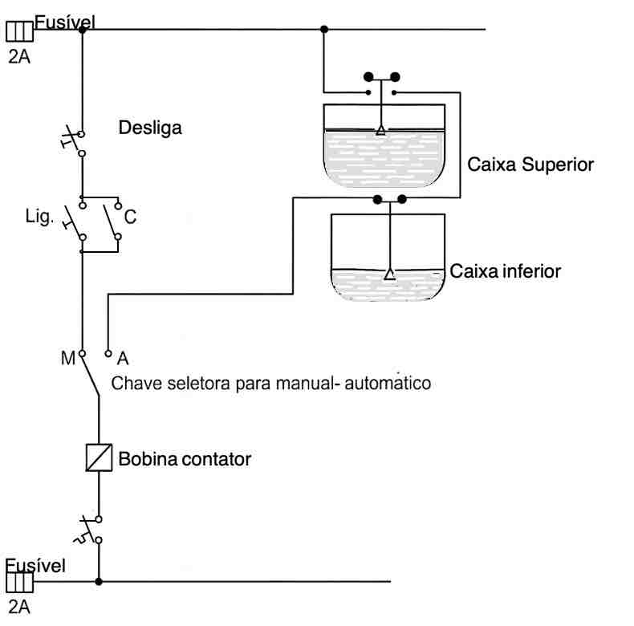

---

